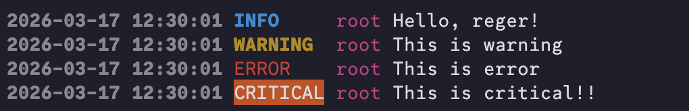

# reger
[](https://www.python.org/downloads/release/python-3100/)


---


discord.py built-in logger is very neat, so I made this from discord py source

Python version: `python>=3.10`

# install
```shell
python3 -m pip install reger
```
or
```toml
dependencies = [
    "reger>=0.1.1",
]
```

# usage
for root logger:
```python
import logging

import reger

reger.setup_logging()
logging.info('Hello, reger!')
```

with file handler:
```python
import logging

import reger

root_logger = logging.getLogger()

file_handler = logging.FileHandler('./latest.log')
file_handler.setFormatter(reger.ColourFormatter())
root_logger.addHandler(file_handler)

reger.setup_logging(logger=root_logger)

logging.info('Hello, reger!')
```

for specific handler:
```python
import logging

import reger

logger = logging.getLogger('TestLogger')
reger.setup_logging(logger=logger)

logger.info('Hello, reger!')
```